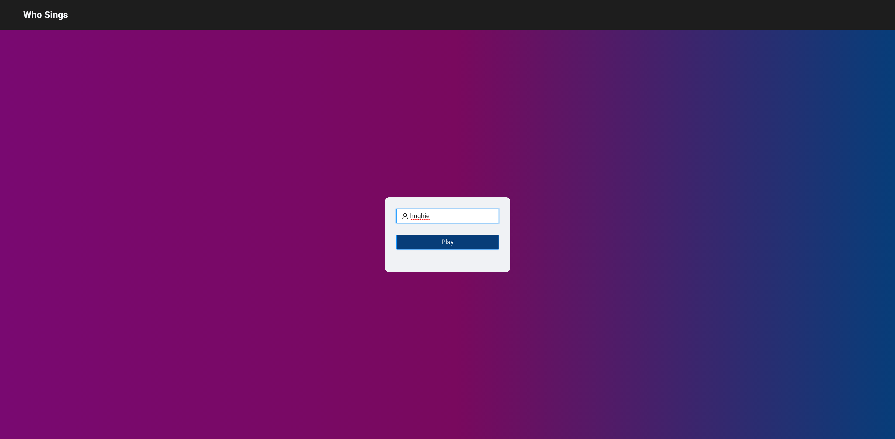
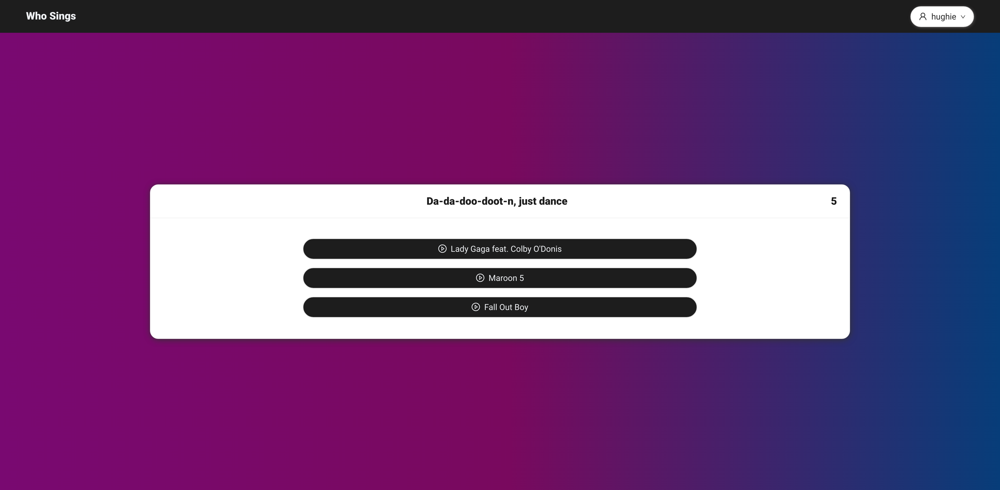
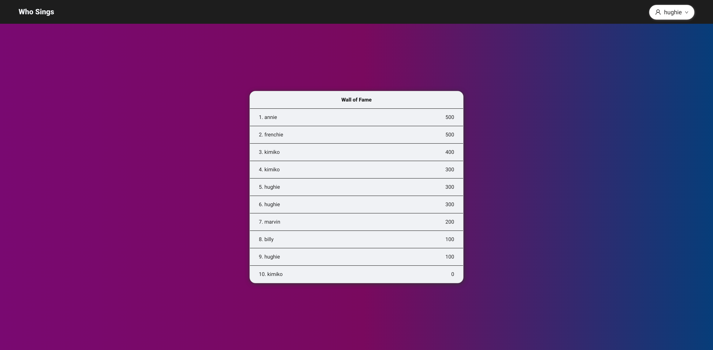
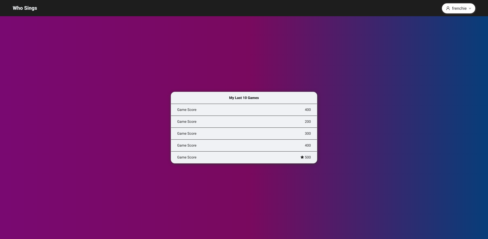
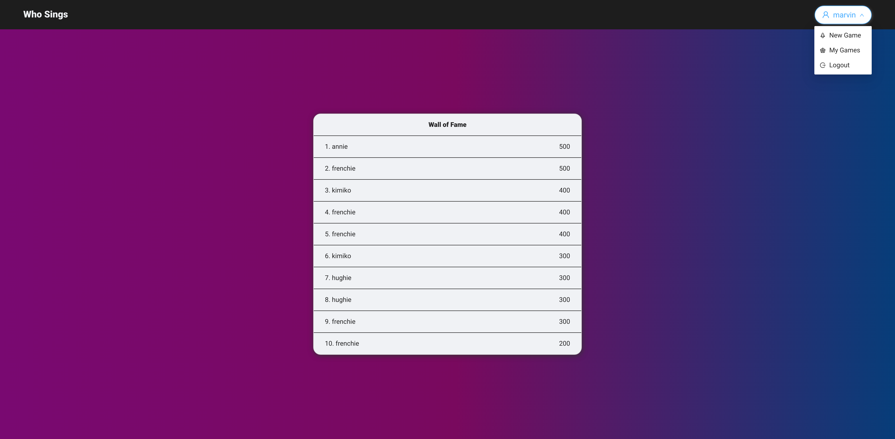

# Who Sings

> A quiz game that uses Musixmatch API.

## General Information

> This project's structure was cloned from a template I created - [react-typescript-template](https://github.com/HereBeAndre/react-typescript-template) - which in turn was originally bootstrapped with [Create React App](https://github.com/facebook/create-react-app).

## Table of Contents

- [Who Sings](#who-sings)
  - [General Information](#general-information)
  - [Table of Contents](#table-of-contents)
  - [Install](#install)
  - [API](#api)
  - [Dealing with CORS](#dealing-with-cors)
  - [Local Environment Setup](#local-environment-setup)
  - [Available Scripts](#available-scripts)
    - [`npm start`](#npm-start)
    - [`npm test`](#npm-test)
    - [`npm run build`](#npm-run-build)
    - [`npm run eject`](#npm-run-eject)
  - [Requirements](#requirements)
  - [Implementation and Features](#implementation-and-features)
    - [User Data Storage](#user-data-storage)
    - [Routing](#routing)
    - [App State](#app-state)
  - [Screenshots](#screenshots)
  - [Room for Improvement](#room-for-improvement)
  - [License](#license)

## Install

Run `npm install` to install all dependencies.\
The complete list of dependencies is included in `./package-lock.json`.

## API

> **Musixmatch API** - (https://developer.musixmatch.com/)

## Dealing with CORS

> A proxy server was deployed on Heroku in order to perform cross-origin requests to the API.\
> The client requests are forwarded by the proxy server to Musixmatch API.

## Local Environment Setup

1. In order to access Musixmatch API from Who Sings, you can create a free plan account on their [developer website](https://developer.musixmatch.com/plans).
2. Once your account is set up and the associated API key is created, open the project in your favorite IDE.
3. In the project's root, create a `.env` file. Inside the file add your API key:

&nbsp;&nbsp;&nbsp;&nbsp;&nbsp;&nbsp;&nbsp;&nbsp;`REACT_APP_MUSIXMATCH_API_KEY = <YOUR_MUSIXMATCH_API_KEY>`

4. Add `.env` to `.gitignore` file.

You should be all set now. If that's not the case, please make sure you've followed the steps above.

## Available Scripts

In the project directory, you can run:

### `npm start`

Runs the app in the development mode.\
Open [http://localhost:3000](http://localhost:3000) to view it in the browser.

The page will reload if you make edits.\
You will also see any lint errors in the console.

### `npm test`

Note: No tests available at the moment.\
Launches the test runner in the interactive watch mode.\
See the section about [running tests](https://facebook.github.io/create-react-app/docs/running-tests) for more information.

### `npm run build`

Builds the app for production to the `build` folder.\
It correctly bundles React in production mode and optimizes the build for the best performance.

The build is minified and the filenames include the hashes.\
Your app is ready to be deployed!

See the section about [deployment](https://facebook.github.io/create-react-app/docs/deployment) for more information.

### `npm run eject`

**Note: this is a one-way operation. Once you `eject`, you can’t go back!**

If you aren’t satisfied with the build tool and configuration choices, you can `eject` at any time. This command will remove the single build dependency from your project.

Instead, it will copy all the configuration files and the transitive dependencies (webpack, Babel, ESLint, etc) right into your project so you have full control over them. All of the commands except `eject` will still work, but they will point to the copied scripts so you can tweak them. At this point you’re on your own.

You don’t have to ever use `eject`. The curated feature set is suitable for small and middle deployments, and you shouldn’t feel obligated to use this feature. However we understand that this tool wouldn’t be useful if you couldn’t customize it when you are ready for it.

## Requirements

> Choose the artist that sings a specific line of lyrics, winning points for every correct choice.

- [x] Quiz card with one line of lyrics and 3 artists to choose from;
- [x] The game ends after completing N quiz cards, one after the other;
- [x] Ask the name of the player with the ability to log off so that another user could play;
- [x] Count the points and save them at the end of the game;
- [x] Game time countdown for every quiz card. Once it runs out you pass to the next quiz card without getting any points.

## Implementation and Features

### User Data Storage

> - User's game data - including username, score and last played games - is stored in Session Storage.
> - When a user logs out, their username and last played games data is stored in Local Storage so that on subsequent log in their data is retrieved from there.

### Routing

> - Routing is handled by `react-router-dom`.
> - User is redirected to login page if they try to access a private route without being logged in.
> - Wildcard route redirects to quiz page.

### App State

> - No state management library was used.
> - The state of the app and its components is handled almost solely via the `useState` hook.
>   In one case I've decided to extract the state in a reducer function, relying on the `useReducer` hook to avoid clogging the component with too many states.
> - Data is always shared top-down between components via props, except for the `cardNumber` variable - a.> k.a. the index of the current quiz snippet - which is accessible everywhere within the app via the >`useContext` hook.

> WIP

## Screenshots

&nbsp;&nbsp;
&nbsp;&nbsp;
&nbsp;&nbsp;
&nbsp;&nbsp;

## Room for Improvement

Todo:

- [ ] App is not fully responsive.\
       Layout works on large screens and laptops, handled in a decent manner on tablet, buggy on mobile;
- [ ] Implement better functionality to fetch tracks and artists;

Known bugs:

- [ ] Responsiveness is missing on smaller devices. See first point of Todo list above;
- [ ] Missing ellipsis in quiz card buttons' text when artist name is overly long;
- [ ] Fix position of lyrics snippet to avoid floating span shift on countdown change;

## License

This project is licensed under the terms of the MIT license.
